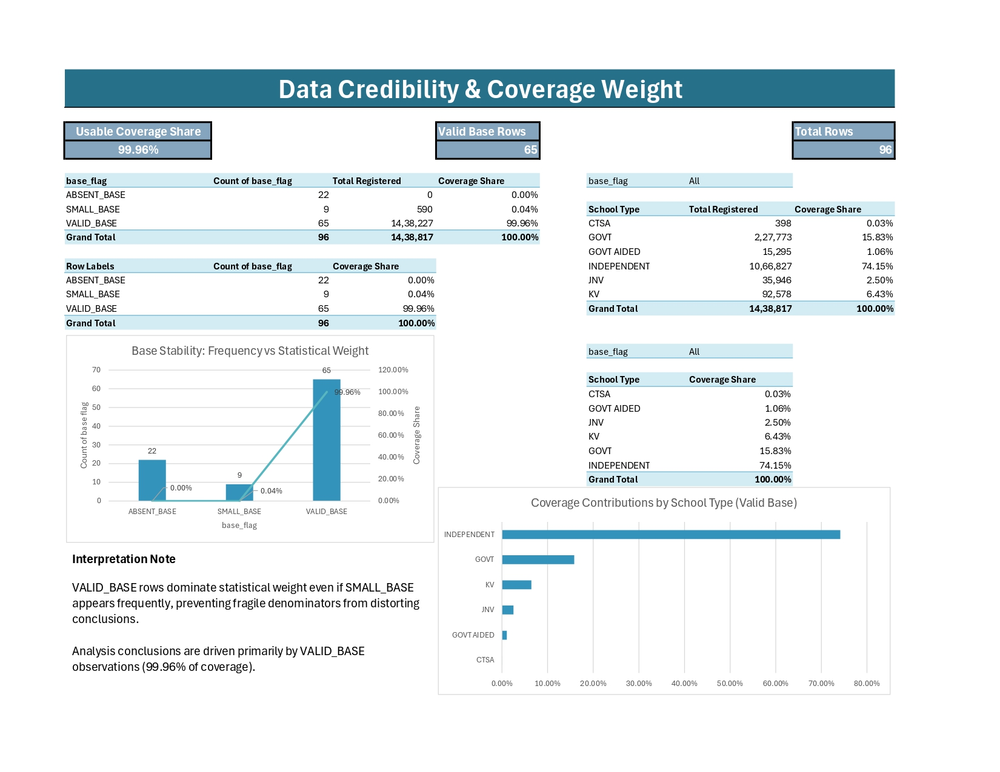
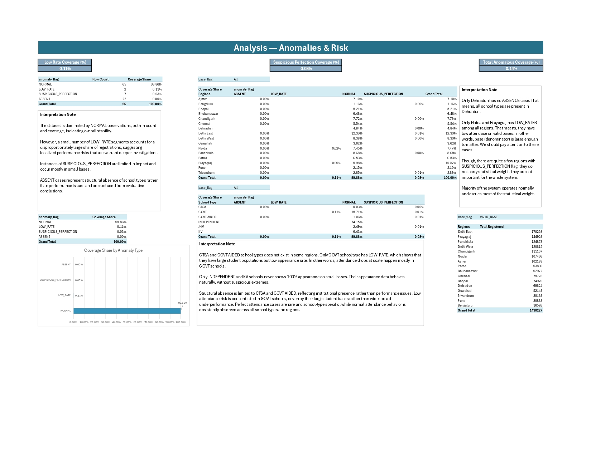
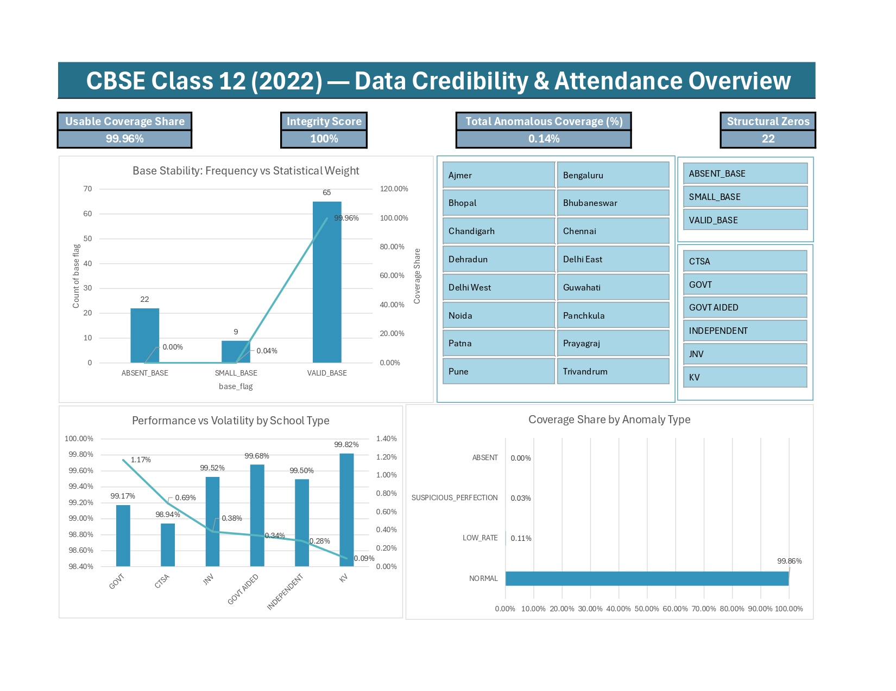

# CBSE Class 12 (2022) — Attendance, Credibility & Risk Analysis

## Project Overview

This project analyzes Class 12 board examination attendance data (2022) across regions and school types, with a strong focus on

- Data credibility
- Coverage-weighted interpretation
- Risk & anomaly detection
- Transparent, reproducible Excel modeling

## Objectives

- Measure overall appearance rates.
- Identify high-impact regions and school types.
- Detect low-attendance risk segments.
- Handle small-base and structural zero cases responsibly
- Demonstrate an industry-grade Excel analytics workflow

## Workbook Architecture

- `01_DATA_MODEL_raw_wide`: Raw source (unchanged)
- `02_FACT_APPEARANCE (VIEW)`: Canonical fact table (Power Query)
- `03_DATA_QUALITY_LOG (VIEW)`: Integrity audit log
- `04_CREDIBILITY`: Base stability & coverage weight
- `05_ANALYSIS`: Anomalies & risk patterns
- `06_VOLATILITY`: Stability & dispersion analysis
- `07_DASHBOARD`: Executive summary
- `99_NOTES`: Assumptions, thresholds, methodology

### Design Principle

- Power Query: row-level logic
- Power Pivot: aggregation & measures
- Excel sheets: interpretation & communication

## Data Preparation & Modeling

- Raw data normalized from wide to long format
- Separate Registered vs Appeared counts
- Derived metrics:

  - `Appearance rate`
  - `No-show rate`
  - `Base status`
  - `Base flag`
  - `Anomaly flag`
  - `Risk buckets`

All transformations are handled only in Power Query to ensure reproducibility.

## Data Quality & Integrity

A dedicated audit log (03_DATA_QUALITY_LOG) validates:

- Missing values
- Rate logic consistency
- Structural zeros

Key result:

- 0 integrity failures
- 22 structural zeros, correctly isolated and excluded from analysis

## Credibility & Coverage Weighting

This analysis distinguishes frequency vs impact

- 65 valid-base segments
- 99.96% usable coverage
- Small-base segments are prevented from distorting conclusions.

Example: Seven "100%" appearance rate cases exist — but together they account for < 0.03 of total registerations.

## Anomaly & Risk Analysis

Segments are classified as:

- `NORMAL`
- `LOW_RATE`
- `SUSPICIOUS_PERFECTION`
- `ABSENT`

### Key findings

- Normal segments dominate system behavior
- Low-rate risk is rare but high-impact
- Perfect attendance mostly occurs on small bases, requiring caution

## Volatility Analysis

- Average appearance rate by school type
- Standard deviation highlights stability vs variability
- Identifies school types where performance is consistent vs fragile

## Executive Dashboard

The dashboard summarizes:

- Usable Coverage Share
- Integrity Score
- Total Anomalous Coverage
- Structural Zeros

All visuals are slicer-driven and coverage-aware

## Methodology & Thresholds

All thresholds are explicitly justified and documented in 99_NOTES.

### SMALL_BASE threshold = 100

Based on:

- Distribution of non-zero bases
- Percentiles and concentration below 100

### LOW_RATE threshold = 0.98

Based on:

- Empirical appearance-rate distribution
- Natural breakpoints where risk emerges

No arbitrary thresholds used.

## Tools & Skills Demonstrated

- Excel (Advanced)
- Power Query (M)
- Power Pivot (DAX)
- Data modeling
- Integrity auditing
- Analytical storytelling
- Documentation & reproducibility

## Key Takeaways

- Coverage-weighted thinking is essential for public-scale data
- Small perfect segments should not dominate narratives
- A clean data model is as important as final metrices
- Excel, when structured correctly, can support serious analytics.
