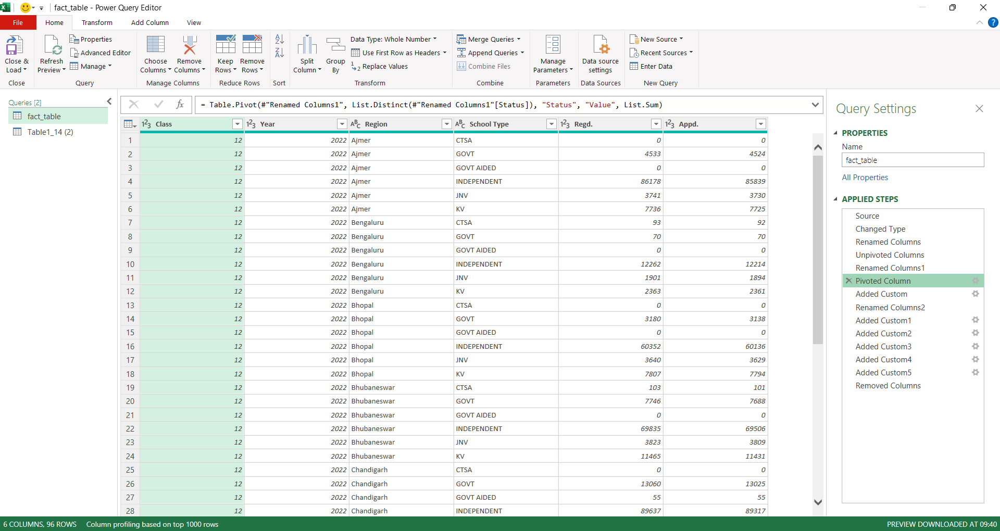

# Power Query Transformation — CBSE Class XII 2022

## Purpose

- This stage prepares the CBSE Class 12 (2022) exam dataset for structured analysis.  

- The transformations in Power Query standardize the raw data and add diagnostic flags, making it easier to spot inconsistencies or unusual patterns in exam appearance records.

- This project provides a reproducible framework for testing data consistency and highlighting risks in exam reporting.

- By moving all transformations into Power Query and the Data Model, the pipeline becomes transparent, auditable, and refreshable.

- Reproducibility means the pipeline can refresh automatically with new CBSE datasets, while thresholds (e.g., base size, LOW_RATE) remain analyst‑defined to preserve judgment.

## Key Transformations

### 1. Load Raw Dataset

- Imported `class12-2022 raw_dataset.csv` into Power Query Editor.
- Standardized headers and data types to ensure schema consistency across regions and school types.
- Renamed `Type` → `Region` to avoid ambiguity in reporting.

Caption: This shows the raw dataset loaded from (https://www.data.gov.in/)

*Analytical Role:* Establishes a clean schema for consistent regional comparisons.

### 2. Unpivot School Type

- Converted wide format (CTSA, GOVT, GOVT AIDED, INDEPENDENT, JNV, KV) into long format.

  
Caption: School type columns before reshaping(wide format).

- Resulting fields: `Attribute`, `Value`. `Attribute` renamed to `School Type`

  
Caption: Unpivoted school type columns — reshaped for slicer‑aware pivots.

*Analytical Role:* Prevents column redundancy and enables slicer-aware pivots. This ensures anomalies in appearance rates can be compared fairly across school types.

### 3. Pivot Value

- Pivoted `Value` column into two fields: `Regd.` and `Appd.`, renamed `Registered` and `Appeared` later.

Caption: Pivoted Value column — separated Registered vs Appeared counts.

*Analytical Role:* Separates registration counts from actual appearances. This highlights credibility risks such as unusually high no-show rates or suspiciously perfect attendance.

### 4. Diagnostic Flags

- Added flags for base status, base size, and anomalies directly in Power Query.

*Analytical Role:* Flags provide early signs of credibility risks - e.g., very low base sizes, abnormal appearance rates, or inconsistent reporting. Embedding them in Power Query ensures reproducibility and transparency.

### 5. Integrity Check Reshaping

- Unpivoted integrity check columns into:
  - `Integrity_CheckType`
  - `Integrity_CheckResult`

*Analytical Role:* Reshaping integrity checks into a single column ensures all checks are applied consistently, avoiding gaps when aggregating or filtering results.

### 6. Clean Output

- Removed unused flags (Error, Missing, Failure — no records present).
- Final query output renamed `class12-2022 result`.
- Loaded into the Data Model for use in pivots and dashboards.

Caption: Final query output — structured dataset loaded into Data Model.

*Analytical Role:* Produces a streamlined dataset where only relevant flags remain. This avoids clutter and ensures dashboards reflect credible, actionable signals.

## Analytical Role

- **Reproducibility:** All transformations and diagnostic flags are embedded in Power Query, so the dataset can refresh automatically with new exam years.
- **Transparency:** Each applied step is documented in the query editor, making the pipeline auditable and easy to review.
- **Consistency:** Reshaping school types and integrity checks ensures comparisons are uniform across regions and institutions.  
- **Pipeline Context:** This transformation corresponds to the `Data Cleaning & Preprocessing stage`.
- **Practical Scope:** This stage delivers a clean, structured dataset that underpins anomaly detection and integrity summaries, without relying on manual worksheet formulas.
