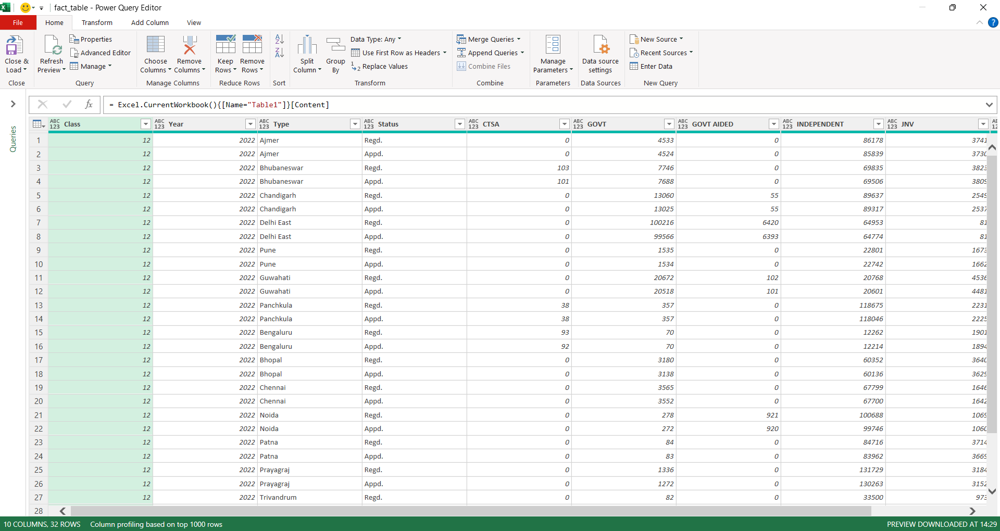
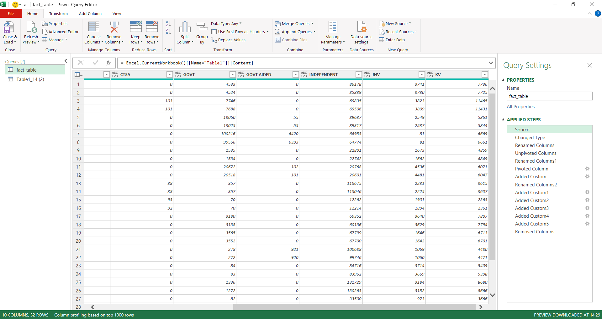
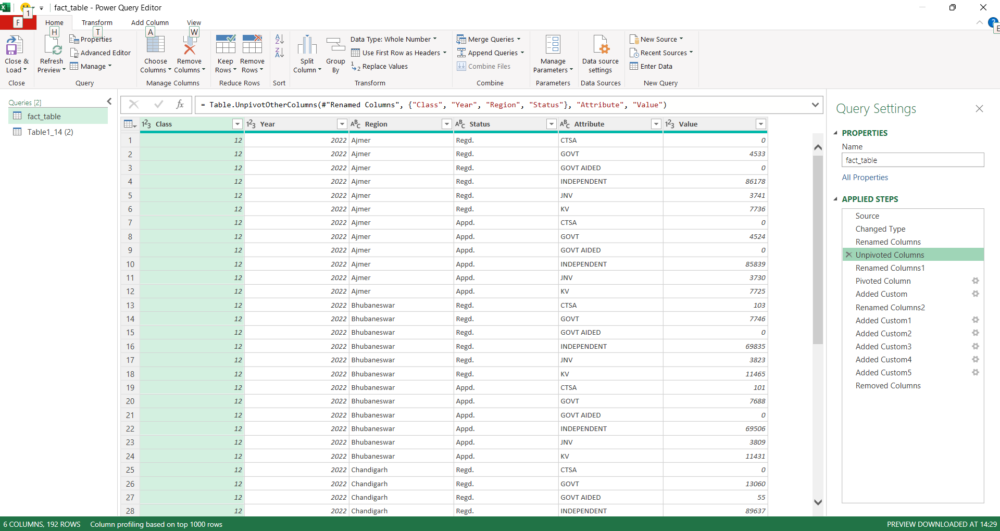
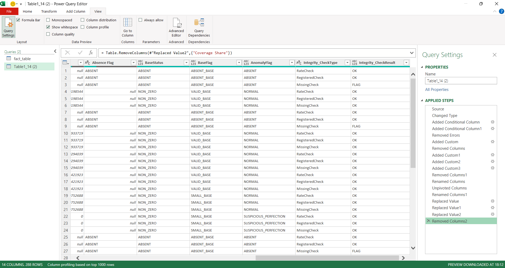

# Power Query Transformation — CBSE Class XII 2022

## Purpose

- This stage reshapes the raw CBSE Class 12 (2022) dataset into a structured format suitable for credibility diagnostics.

- Power Query was used to clean, normalize, and compute foundational fields.

- By migrating diagnostic flags into Power Query and unpivoting integrity checks, the pipeline becomes reproducible, transparent, and fully refreshable.

## Key Transformations

### 1. Load Raw Dataset

- Imported `class12-2022 raw_dataset.csv` into Power Query Editor.
- Standardized headers and data types.
- Renamed `Type` → `Region` for clarity.

### 2. Unpivot School Type

- Converted wide format (CTSA, GOVT, GOVT AIDED, INDEPENDENT, JNV, KV) into long format.
- Resulting fields: `School Type`, `Value`.

### 3. Pivot Value

- Pivoted `Value` column into two fields: `Registered` and `Appeared`.

*Pivoting Status column produces separate fields for Registered and Appeared counts.*

### 4. Diagnostic Flags

- Added flags for base status, base size, and anomalies directly in Power Query.
- Ensures reproducibility and removes dependency on worksheet formulas.

### 5. Integrity Check Reshaping

- Unpivoted integrity check columns into:
  - `Integrity_CheckType`
  - `Integrity_CheckResult`
- Expanded row count (each record contributes multiple check results).
- Enables consistent pivoting and aggregation across check types.

### 6. Clean Output

- Removed unused flags (Error, Missing, Failure — no records present).
- Final query output renamed `class12-2022 result`.
- Loaded into the Data Model for use in pivots and dashboards.

## Analytical Role

- **Reproducibility:** All transformations and flags are now calculated within Power Query or DAX.  
- **Transparency:** Applied steps are visible and auditable in the query editor.  
- **Consistency:** Unpivoted integrity checks and diagnostic flags ensure slicer‑aware pivots across all dashboards.  
- **Pipeline Context:** This transformation corresponds to the **Data Cleaning & Preprocessing stage**, feeding downstream integrity, anomaly, and volatility summaries.
